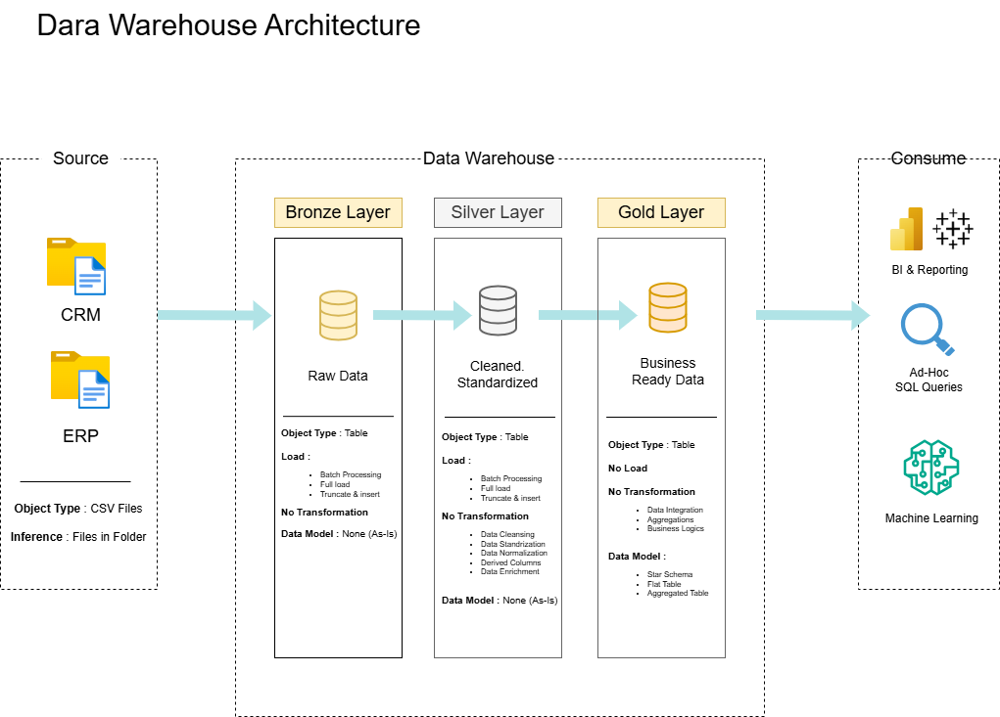

# Proyek Data Warehouse dan Analitik

Selamat datang di repositori Proyek Data Warehouse dan Analitik! 🚀 
Proyek ini dirancang untuk menunjukkan solusi lengkap dalam data warehousing dan analitik, mulai dari membangun data warehouse hingga menghasilkan wawasan yang bermanfaat. Sebagai proyek portofolio, ini menampilkan praktik terbaik di industri dalam rekayasa data dan analitik.

---
## Arsitektur Data

Arsitektur data dalam proyek ini mengikuti Medallion Architecture dengan tiga lapisan utama: **Bronze**, **Silver**, dan **Gold**.

1. **Lapisan Bronze**: Menyimpan data mentah apa adanya dari sistem sumber. Data diambil dari file CSV dan dimasukkan ke dalam database SQL Server.
2. **Lapisan Silver**: Melakukan proses pembersihan, standarisasi, dan normalisasi data agar siap untuk dianalisis.
3. **Lapisan Gold***: Berisi data yang telah siap digunakan untuk bisnis, dimodelkan dalam skema bintang (star schema) untuk kebutuhan pelaporan dan analitik.

---
## Ringkasan Proyek

Proyek ini mencakup:

1. **Arsitektur Data:** Merancang Data Warehouse modern menggunakan Medallion Architecture Bronze, Silver, dan Gold.
2. **ETL Pipelines:** Mengekstrak, mentransformasikan, dan memuat data dari sistem sumber ke dalam warehouse.
3. **Pemodelan Data:** Mengembangkan tabel fakta dan dimensi yang dioptimalkan untuk kueri analitik.
4. **Analitik & Pelaporan:** Membuat laporan berbasis SQL dan dashboard untuk menghasilkan wawasan yang dapat ditindaklanjuti.

---
## Link & Alat yang digunakan dalam projek ini

Semua tersedia secara gratis!

- Dataset: Akses dataset proyek (file CSV).
- **[SQL Server Express](https://www.microsoft.com/en-us/sql-server/sql-server-downloads):**: Server ringan untuk menjalankan database SQL.
- **[SQL Server Management Studio (SSMS)](https://learn.microsoft.com/en-us/sql/ssms/download-sql-server-management-studio-ssms?view=sql-server-ver16):** Antarmuka GUI untuk mengelola dan berinteraksi dengan database.
- **[Git Repository](https://github.com/):** Buat akun GitHub dan repositori untuk mengelola, melakukan versioning, dan berkolaborasi pada kode.
- **[DrawIO](https://www.drawio.com/):** Mendesain arsitektur data, model, alur, dan diagram.
- **[Notion](https://www.notion.com/):** Alat all-in-one untuk manajemen proyek dan organisasi.

---
## Persyaratan Proyek

### Membangun Data Warehouse (Data Engineering)

#### Objekif
Membangun data warehouse modern dengan SQL Server untuk menggabungkan data penjualan, sehingga bisa digunakan untuk pelaporan analitik dan pengambilan keputusan yang lebih baik.

#### Spesifikasi
- **Sumber Data**: Mengimpor data dari dua sistem utama (ERP dan CRM) dalam format CSV.
- **Kualitas Data**: Membersihkan dan menangani masalah kualitas data sebelum dianalisis.
- **Integrasi**: Menggabungkan data dari kedua sumber menjadi satu model yang mudah digunakan untuk analisis.
- **Ruang Lingkup atau Scope**: Hanya menggunakan data terbaru, tanpa perlu menyimpan histori.
- **Dokumentatasi**: Menyediakan dokumentasi yang jelas agar mudah dipahami oleh tim bisnis dan analitik.

---
